# mini-project-aws-s3-bucket-policy-exploration

In this project, I will manage access to my Amazon S3 buckets using S3 bucket policies. The project will guide me through creating a simple S3 bucket, defining a policy to control access permissions, and testing the policy by uploading and retrieving objects.

### Objectives:

1. Create an S3 bucket
1. Develop a custom S3 bucket policy to manage access
1. Upload and retrieve objects to test the policy configuration.

### TASK 1: Create an S3 Bucket
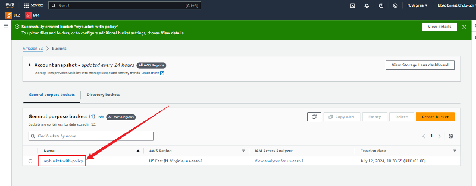

Upload Object
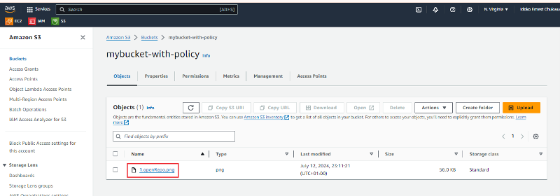

### Accessing the object: 
Unable to access the object URL because it is set to private which means all public access is blocked.
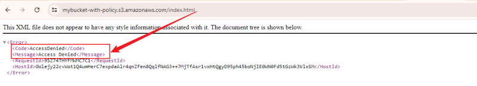
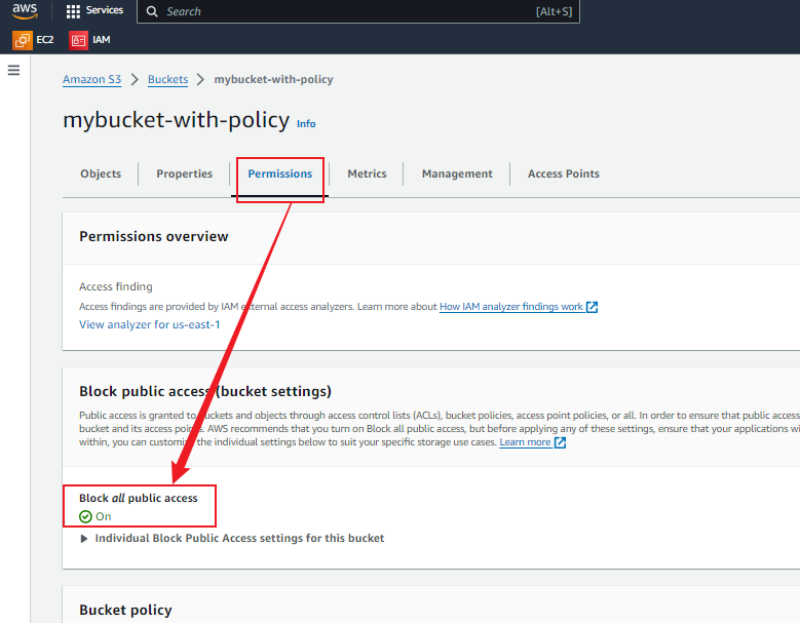
Permission showing that all public access are blocked.

### To allow public access
- Click on edit under permissions to be able to access it
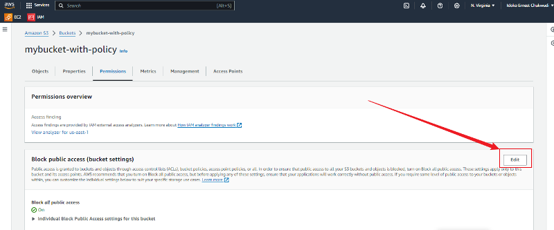

- Click on "Block all public access" to activate public access
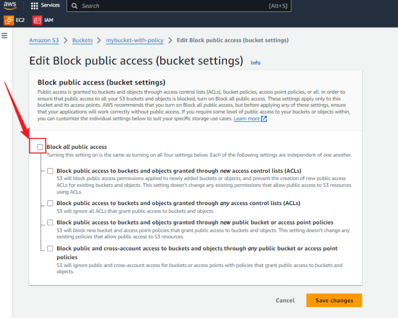

- Click `Confirm` to confirm your action
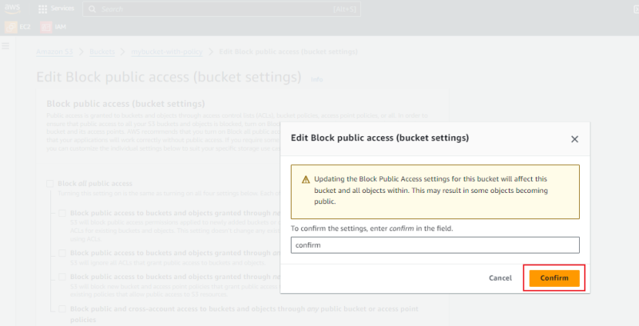

- I made sure that my bucket policy permits public access by adding a JSON policy to my bucket that enables this.
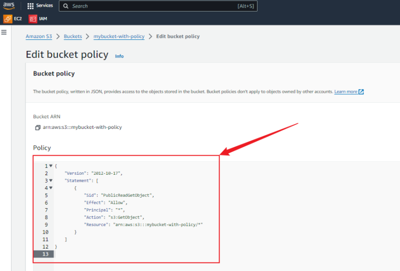

### Test the access by retrieving the bucket object.

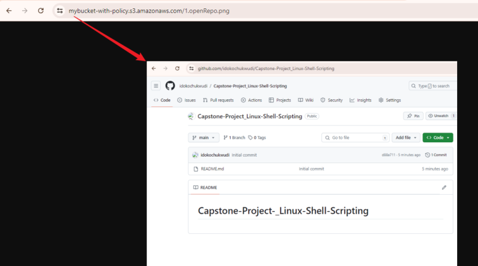

By following these steps, I was able to create a new bucket, upload an object, and make my S3 bucket and objects publicly accessible.

### TASK 2: Testing Access Control
- **Finding and Restricting IP Addresses:** 
- **Step 1:** Identify the IP Address: To test access from my own machine, I can find my public IP address by visiting a site like google.com and searching for **what is my IP** on Google. This will provide me with the IP address of my current internet connection.

    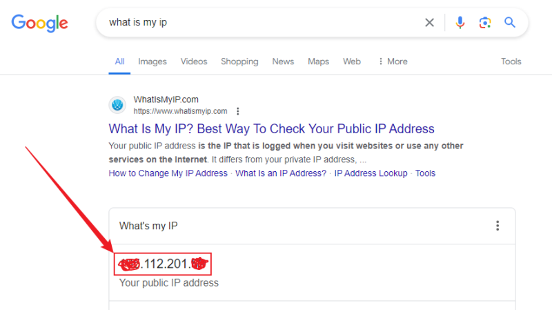

- **Step 2:** Modify my Bucket Policy to restrict access from the IP address `---.0.112.201.--`

    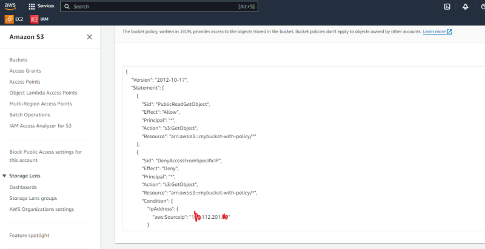

    - Access Object URL in my browser to verify Denial:
    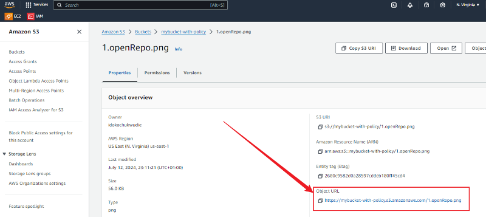
    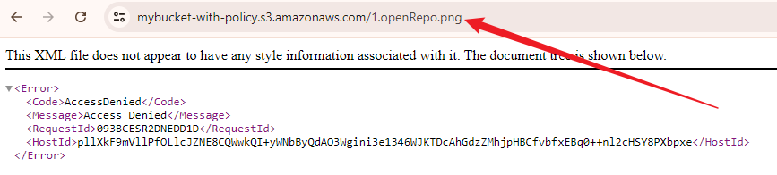

    - Step 3: Modify my Bucket Policy to allow access from the IP address `---.0.112.201.--`
    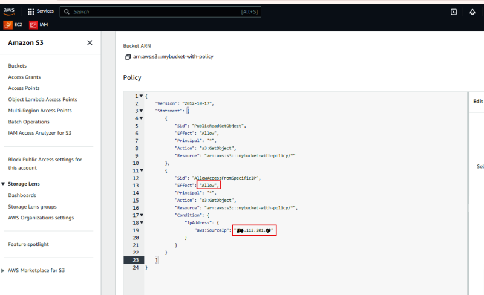

    - Open the Object URL in my browser to confirm that access has been granted:
    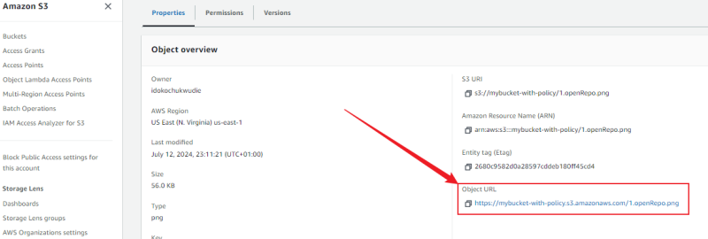
    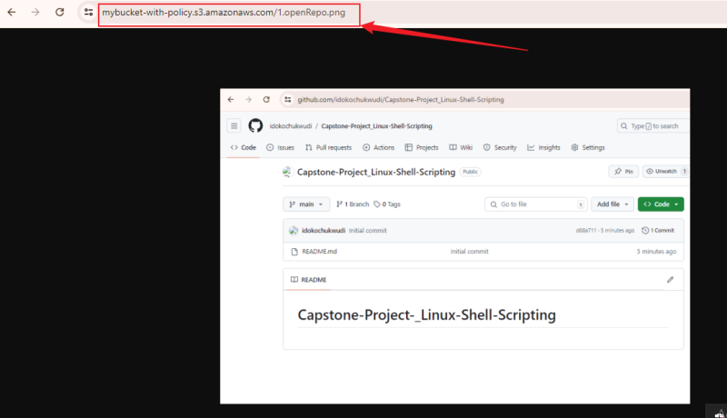

    ### Use of different IAM Users
    
    - Create user John to have S3readOnlyAccess
    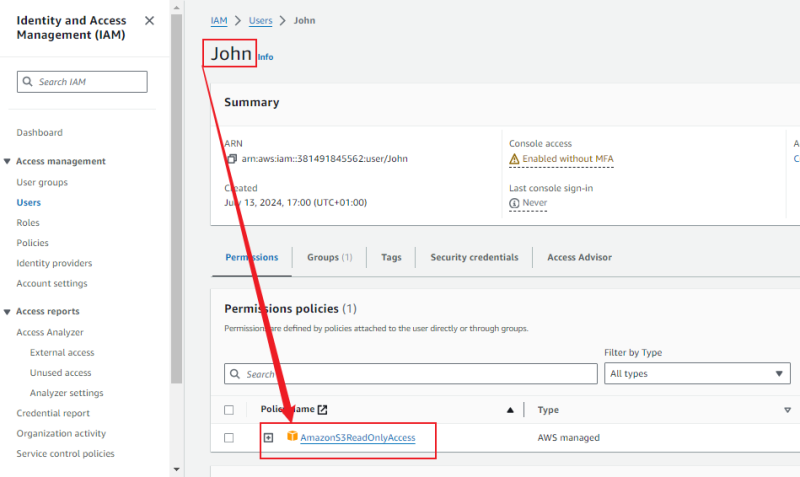

    - Deny John Access to my S3 Bucket
    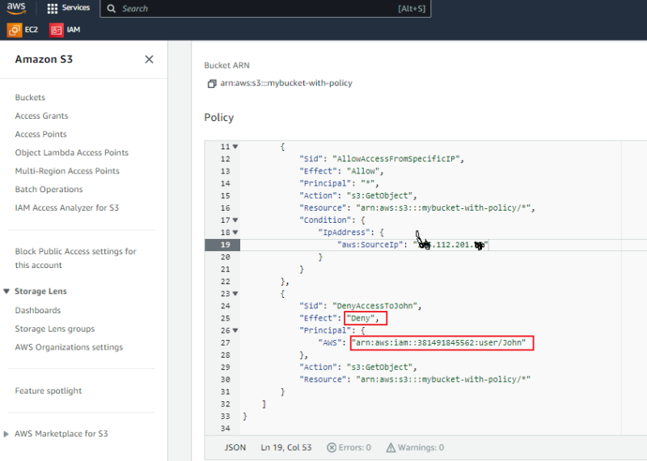

    - Log in IAM user to access bucket
    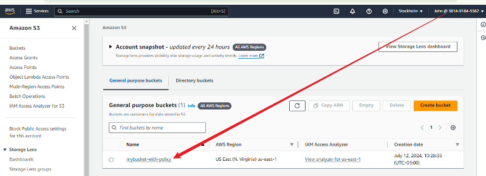

    - John click on Object URL
    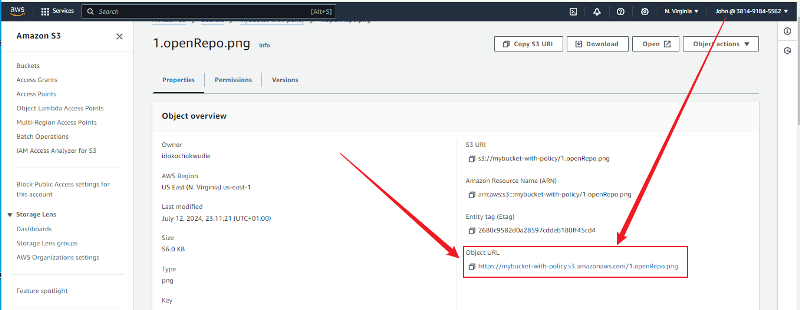

    - John was able to access the bucket object via the object URL
    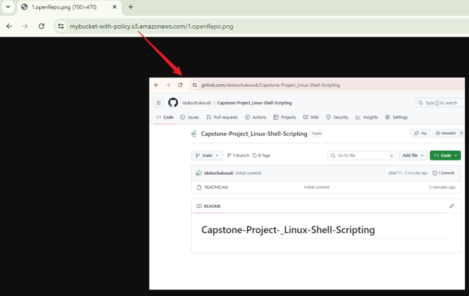

    ### ISSUE IDENTIFIED
    When John accessed the URL, he was able to access my S3 bucket, which was not intended. This occurred because I attached the AmazonS3ReadOnlyAccess policy to John's IAM user, which overrode the denied access policy I created. The explicit allow in John's IAM policy caused this override.

    ### SOLUTION:
    - To resolve this issue, I will have to remove AmazonS3ReadOnlyAccess policy from John and assign Specific IAM Policy for John as John still needs read-only access to other S3 buckets.
    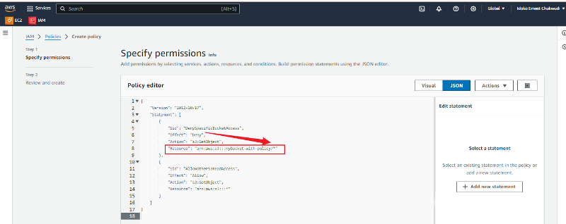

    - John try to open the bucket
    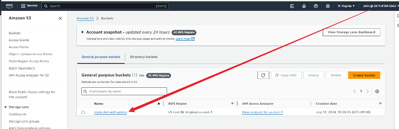

    - Access Denied
    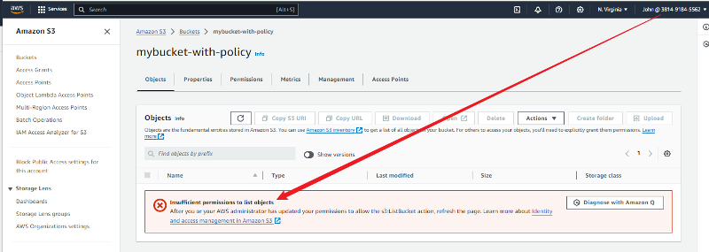

    ### Create IAM user Mary and assign IAM Policy for Mary that would allow her have access to S3 Bucket object

    - Allow policy for mary 
    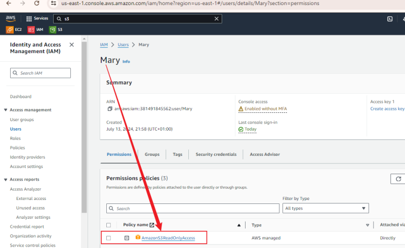

    - Mary access bucket
    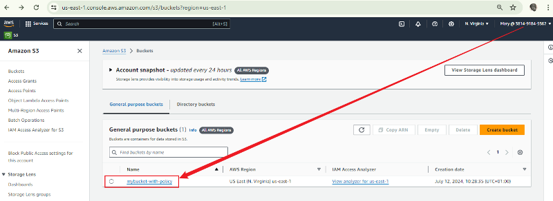

    - Mary Click on object URL
    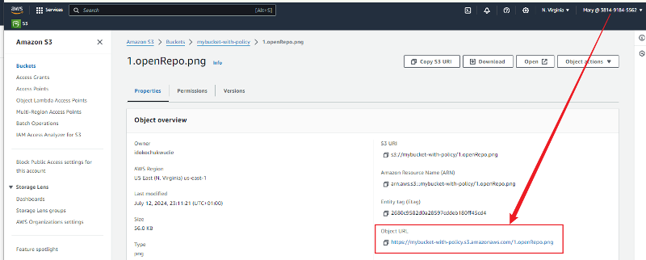

    - Mary is able to access the bucket object
    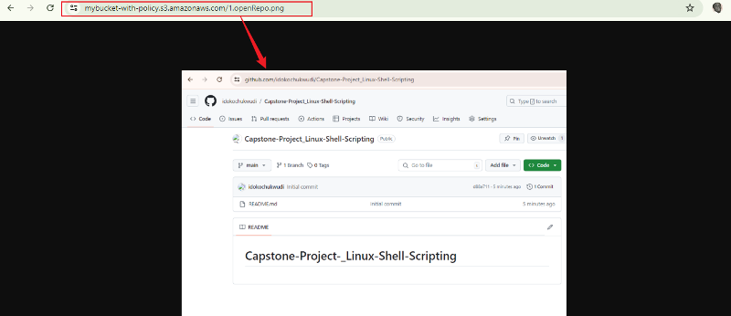

    The above implementation demonstrates my attempt to retrieve the object from various scenarios using two IAM users.
    
### Conclusion
This mini-project involved managing access to Amazon S3 buckets using S3 bucket policies. The main tasks included creating an S3 bucket, defining policies to control access permissions, and testing these policies by uploading and retrieving objects.

Through the steps detailed, I was able to:

1. Successfully create an S3 bucket and upload an object.
1. Adjust the bucket policy to allow public access and verify that the object could be accessed publicly.
1. Test access control by restricting and allowing access based on IP addresses.
1. Explore the impact of IAM policies on bucket access:

I encountered an issue where the AmazonS3ReadOnlyAccess policy attached to a user named John overrode the denied access policy I created. This was due to an explicit allow in the IAM policy, demonstrating the precedence of allow policies over deny policies in specific scenarios.