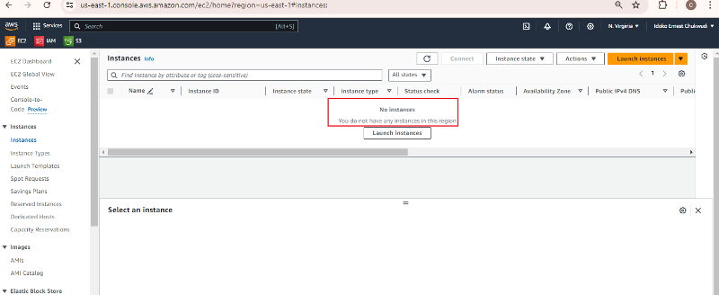
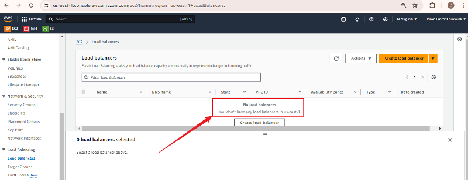
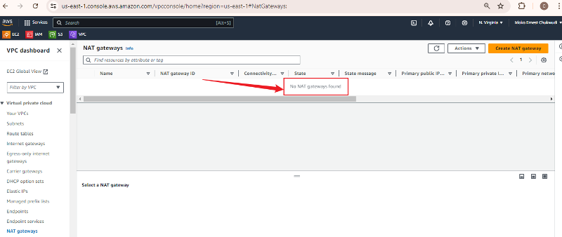
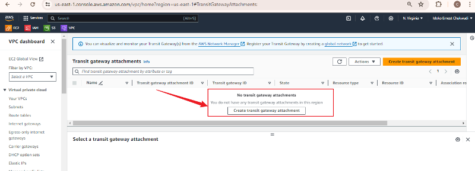
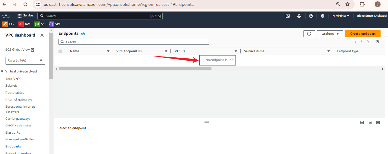
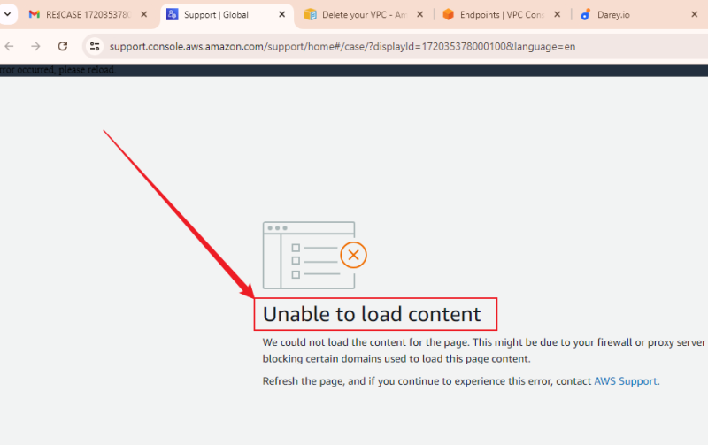

### FEED BACK DOCUMENATION
I have reviewed the link https://docs.aws.amazon.com/vpc/latest/userguide/delete-vpc.html as directed to verify if my VPC has been successfully terminated.

Here are screenshots of the various domains visited to confirm that I have followed the steps outlined in the documentation, as requested for further action on your part.

- **EC2 Status:**

- **Load balancers Status:**

- **NAT gateways Status:**

- **Transit gateway VPC attachments Status:**

- **Interface VPC endpoints Status:**

Please assist in ensuring that there are no active services that could incur charges on my account. I had to document this response in this manner because I was unable to access the support ticket for this issue via the provided link on my laptop; however, I was able to access it using my Android phone. I chose to use my laptop for documentation as it is more flexible. Below is a screenshot of the error message that appears after several refresh attempts.

